# 💻 Commands used to run the program 👨🏻‍💻

<div align="center">


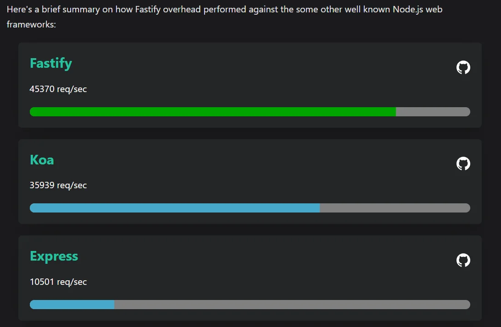

</div>

## NODEJS and PNPM

```sh
$ pnpm i
```

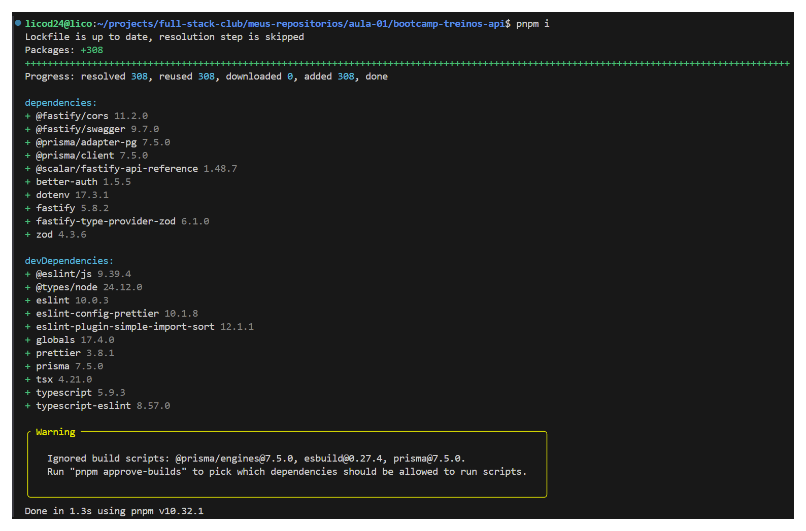

## Docker PostgreSQL database

```sh
$ docker compose up -d
```

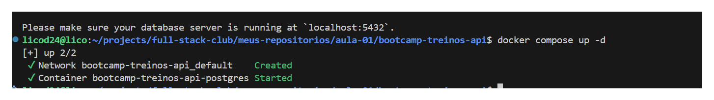

## Generate, format, and update the database and run the application.

```sh
$ npx prisma db push
```

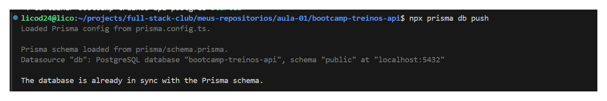

```sh
$ npx prisma generate
```

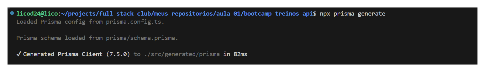

```sh
$ npx prisma format
```

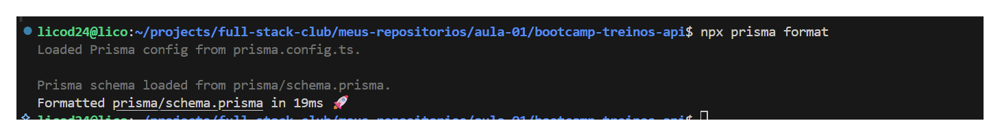

```sh
$ pnpm run dev
```

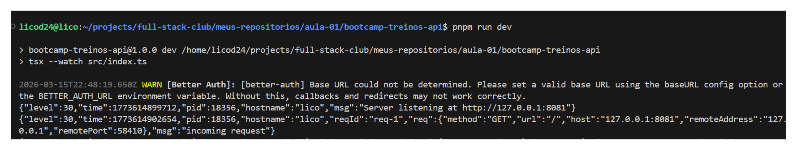

## Better-Auth

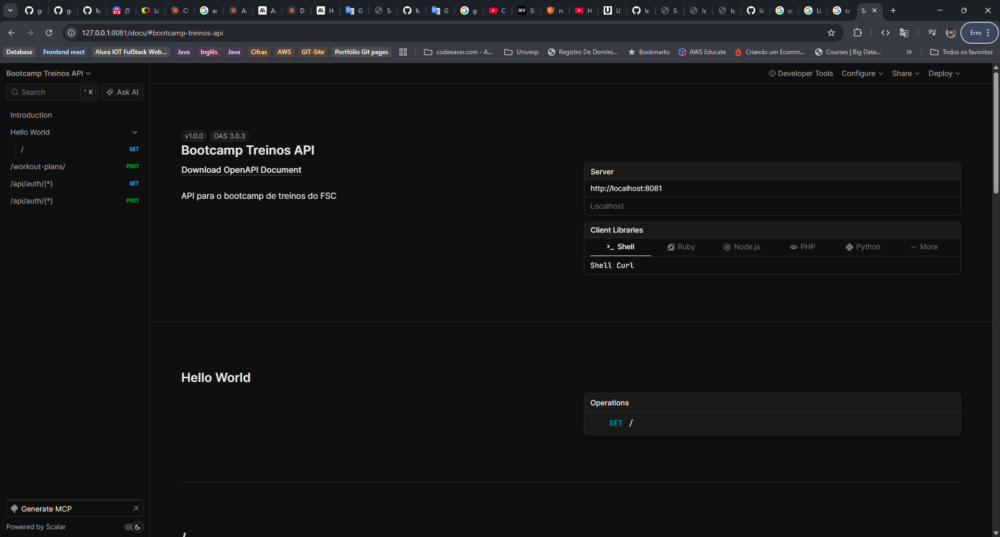

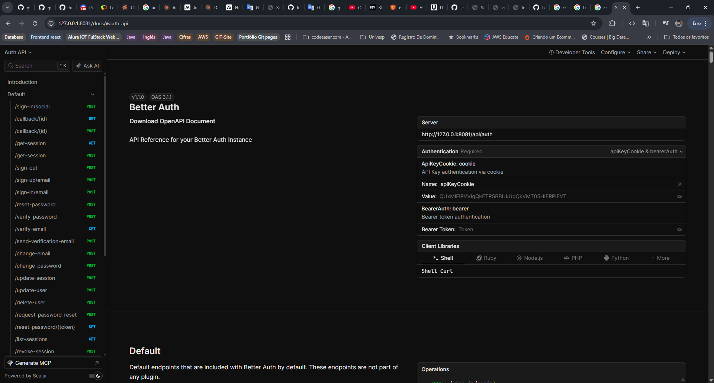

## Prisma Studio

- Visualizar as tabelas de criação

```sh
npx prisma studio
```

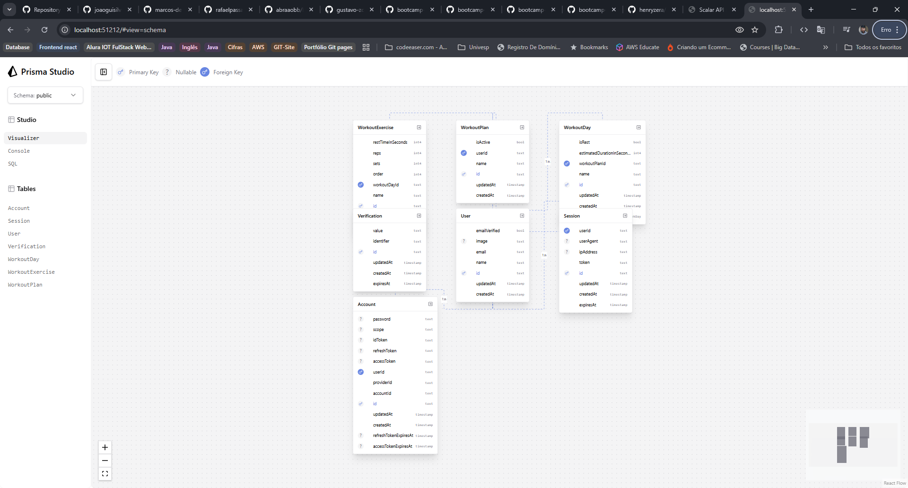

### Tables

- Accout

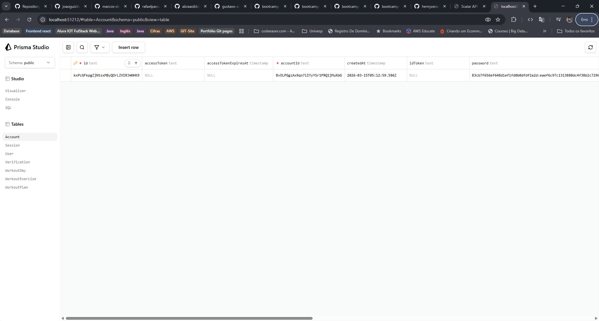

- User

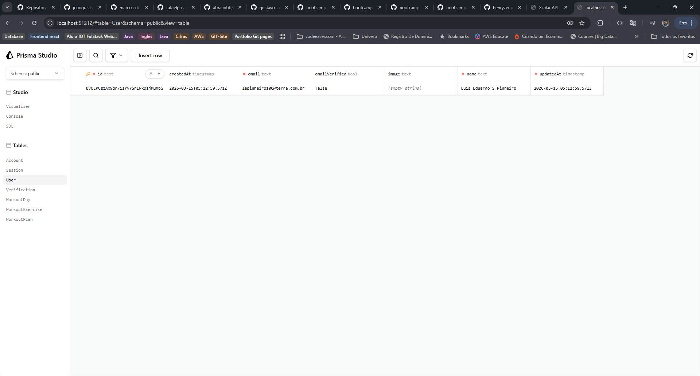

-Workoutday

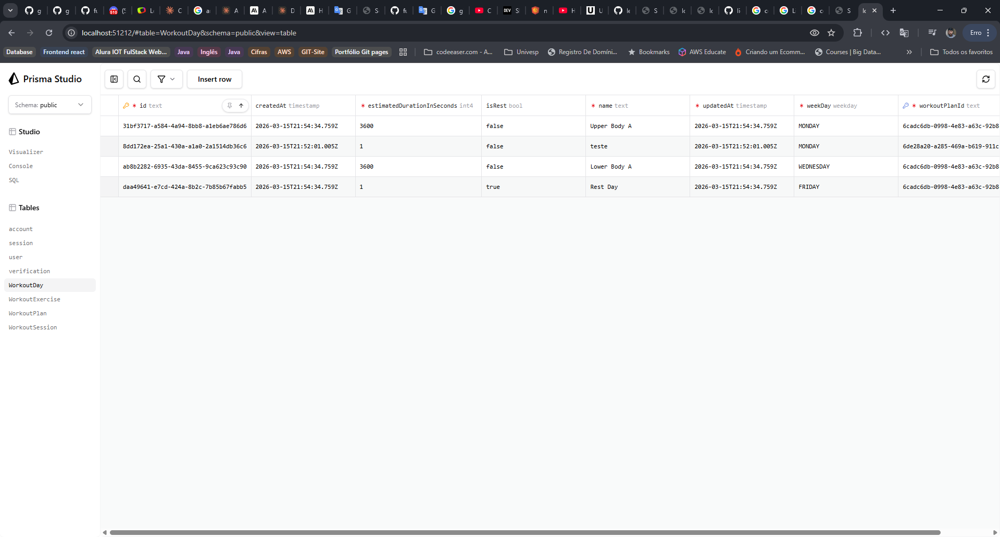

- workoutExercise

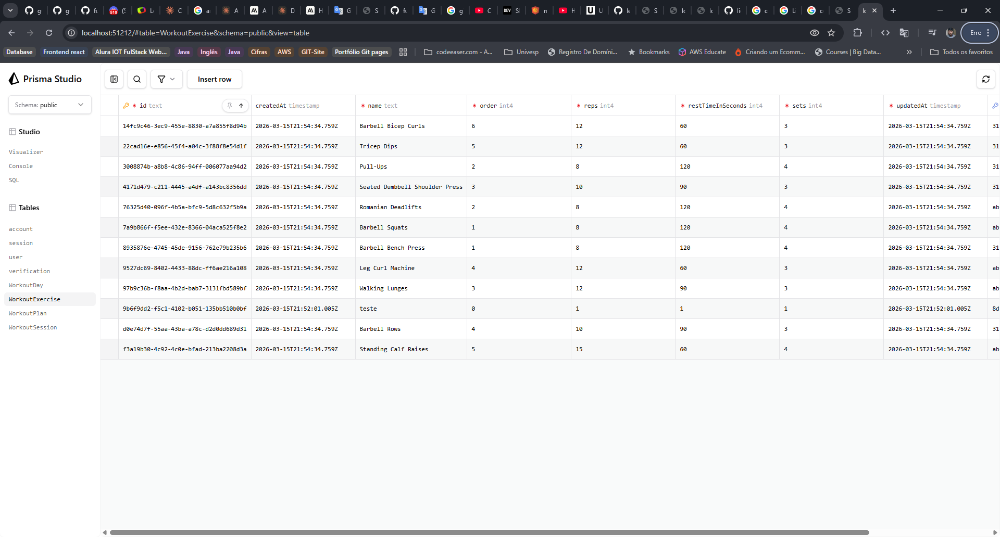

- WorkoutPlan

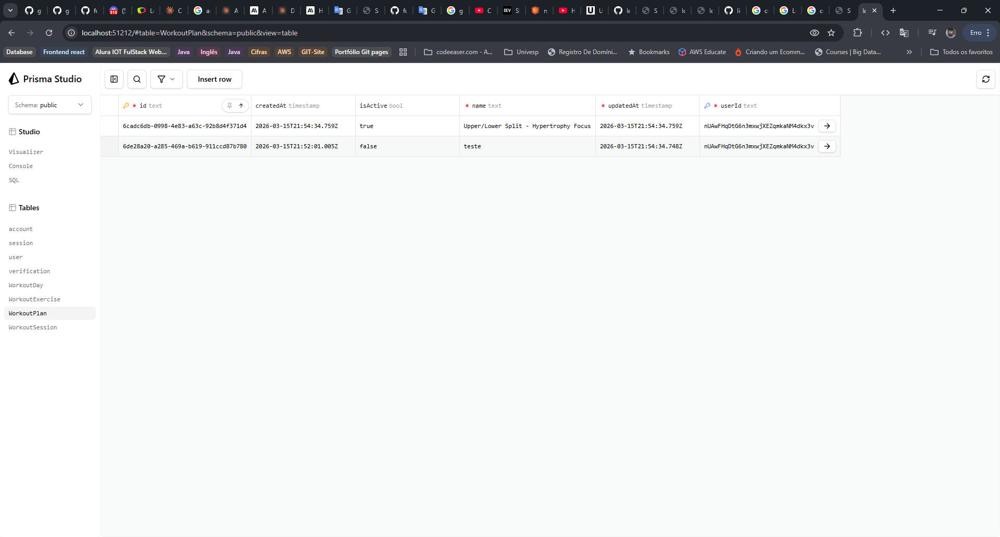

## Test the application using JSON

- Create User AUTH API

```json
{
  "name": "Luis Eduardo S Pinheiro",
  "email": "lepinheiro100@terra.com.br",
  "password": "Tim@o100",
  "image": "",
  "callbackURL": "",
  "rememberMe": true
}
```

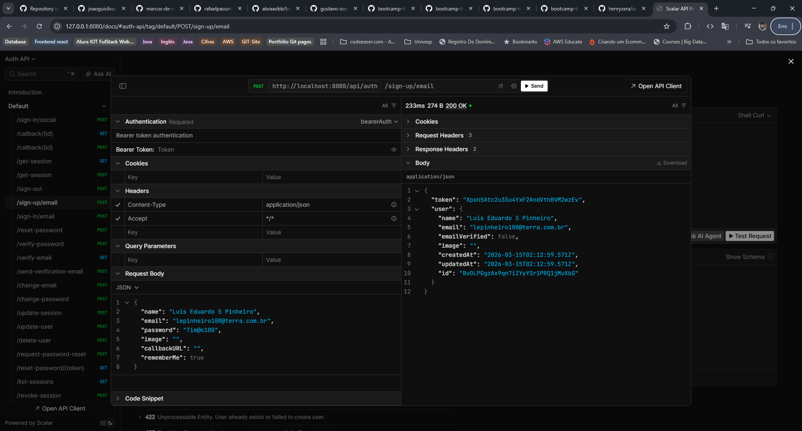

- login

```json
{
  "email": "lepinheiro100@terra.com.br",
  "password": "Tim@o100",
  "callbackURL": "",
  "rememberMe": true
}
```

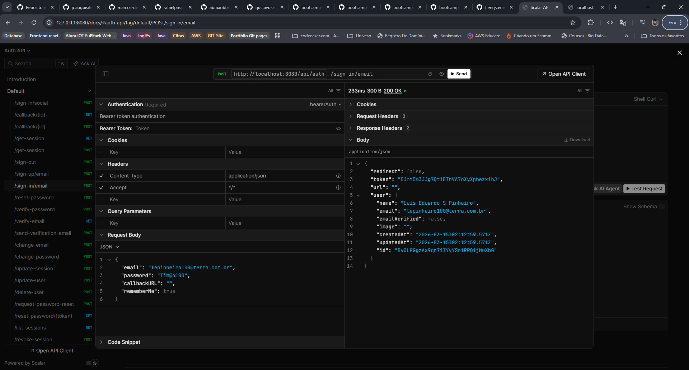

```json

{
  {
  "name": "Luis Eduardo S Pinheiro",
  "workoutDays": [
    {
      "name": "Teste",
      "weekDay": "MONDAY",
      "isRest": false,
      "estimatedDurationInSeconds": 1,
      "exercises": [
        {
          "order": 0,
          "name": "Teste",
          "sets": 1,
          "reps": 1,
          "restTimeInSeconds": 1
        }
      ]
    }
  ]
}
}
```

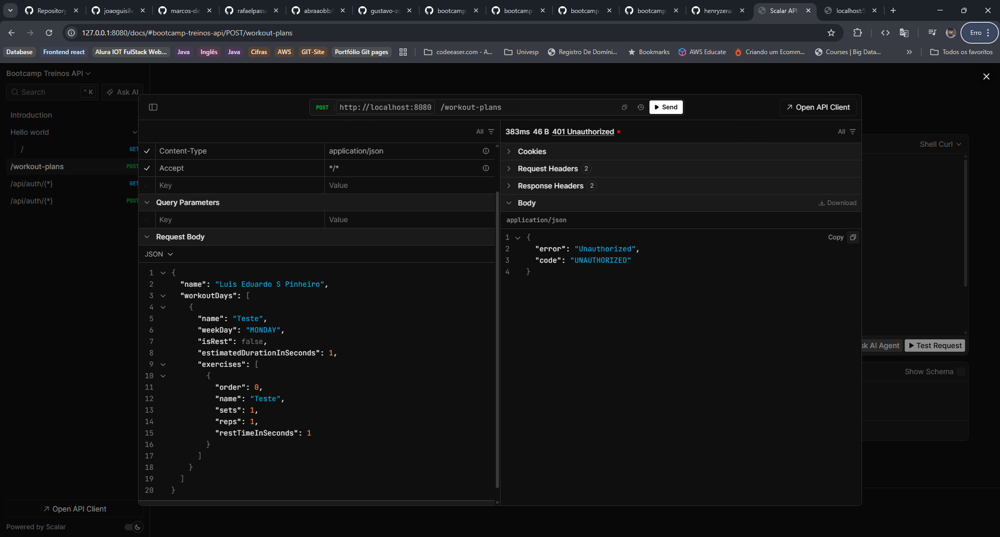

## Claude code

> https://code.claude.com/docs/en/setup

> https://platform.claude.com/docs/en/get-started

```sh
npm install -g @anthropic-ai/claude-code
```


## Github

> https://comandosgit.github.io/

- Fork the application so you can receive updates and also contribute.

- create a new repository on the command line

```sh
$ git init
git add README.md
git commit -m "first commit"
git branch -M main
git remote add origin https://github.com/licodevone/bootcamp-treinos-api.git
git push -u origin main
```

- push an existing repository from the command line

```sh
$ git remote add origin https://github.com/licodevone/bootcamp-treinos-api.git
git branch -M main
git push -u origin main
```

```sh
$ git branch
```

- Show the name of the Branch

```sh
$ git branch-a
```

- Create a new branch

```sh
$ git checkout -b
```

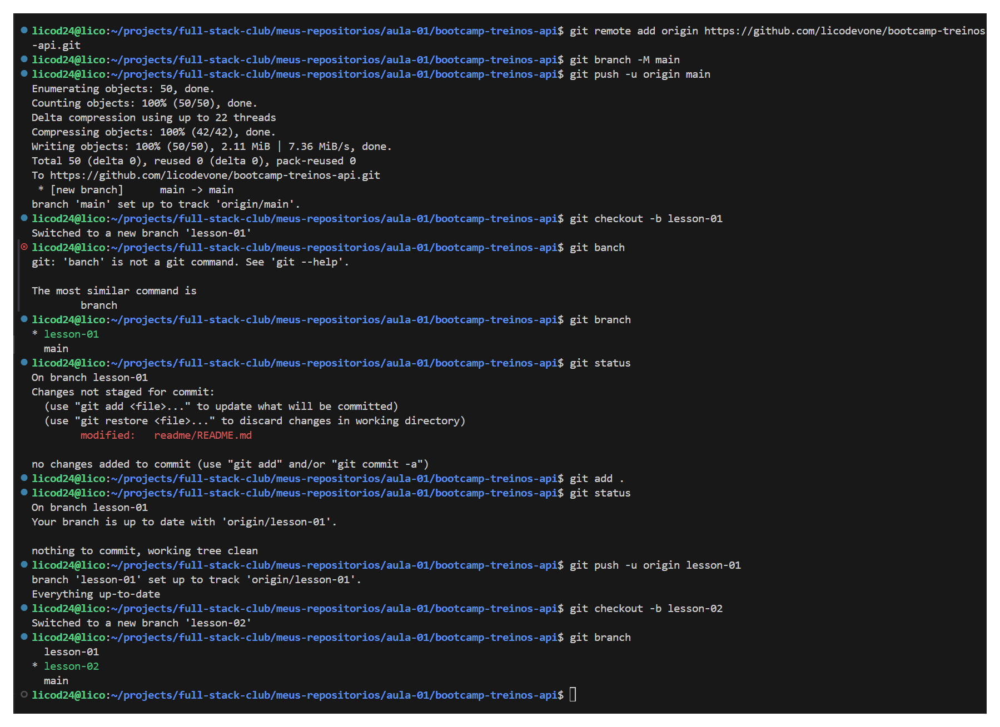

- Check if the change worked

```sh
$ git remote -v
```

- Change the remote repository

```sh
$ git remote set-url origin <URL_NEW_REPOSITORY>
```

- Remove and Add

```sh
$ git branch -d main
$ git remote add origin <URL_NEW_REPOSITORY>
```

- Check if the change worked

```sh
$ git remote -v
```

- Rename remote repository

```sh
$ git remote rename <new name> <old name>
```

- Update remote branches

```sh
$ git fetch --all
```

- Switch to an existing branch

```sh
$ git switch <branch name>
```

- Create and switch to a new branch

```sh
$ git switch -c <branch name>
```

- Return to previous branch

```sh
$ git switch -
```

- Update local branches with the new repository

```sh
$ git fetch --all
```

```sh
4 git pull
```
