# 💻 Commands used to run the program 👨🏻‍💻

## NODEJS and PNPM

### Install NVM

> https://github.com/nvm-sh/nvm?tab=readme-ov-file#installing-and-updating

```sh
curl -o- https://raw.githubusercontent.com/nvm-sh/nvm/v0.40.4/install.sh | bash
```

### Install PNPM

```sh
$ curl -fsSL https://get.pnpm.io/install.sh | sh -
```

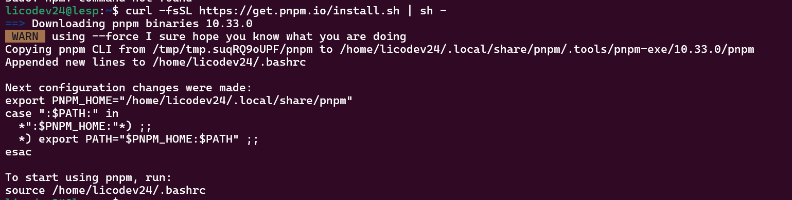

### Installing Nodejs dependencies using pnpm

```sh
$ pnpm i
```


## Docker PostgreSQL database

```sh
$ docker compose up -d
```


## Extensões VSCode

- Prisma

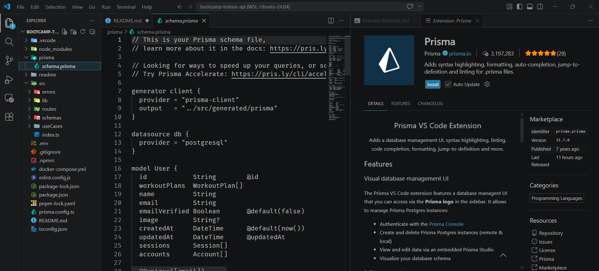

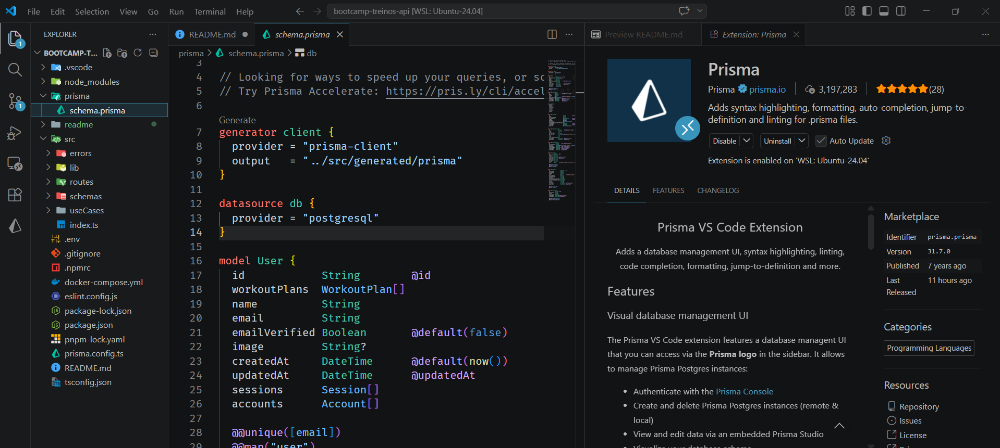

## Generate, format, and update the database and run the application.

```sh
$ npx prisma db push
```


```sh
$ npx prisma generate
```


```sh
$ npx prisma format
```


```sh
$ pnpm run dev
```


## Better-Auth


## Prisma Studio

- Visualizar as tabelas de criação

```sh
npx prisma studio
```


### Tables

- Accout


- User


-Workoutday


- workoutExercise


- WorkoutPlan


## Test the application using JSON

- Create User AUTH API

```json
{
  "name": "Luis Eduardo S Pinheiro",
  "email": "lepinheiro100@terra.com.br",
  "password": "Tim@o100",
  "image": "",
  "callbackURL": "",
  "rememberMe": true
}
```


- login

```json
{
  "email": "lepinheiro100@terra.com.br",
  "password": "Tim@o100",
  "callbackURL": "",
  "rememberMe": true
}
```


```json

{
  {
  "name": "Luis Eduardo S Pinheiro",
  "workoutDays": [
    {
      "name": "Teste",
      "weekDay": "MONDAY",
      "isRest": false,
      "estimatedDurationInSeconds": 1,
      "exercises": [
        {
          "order": 0,
          "name": "Teste",
          "sets": 1,
          "reps": 1,
          "restTimeInSeconds": 1
        }
      ]
    }
  ]
}
}
```


## Github

> https://comandosgit.github.io/

- Fork the application so you can receive updates and also contribute.

- create a new repository on the command line

```sh
$ git init
git add README.md
git commit -m "first commit"
git branch -M main
git remote add origin https://github.com/licodevone/bootcamp-treinos-api.git
git push -u origin main
```

- push an existing repository from the command line

```sh
$ git remote add origin https://github.com/licodevone/bootcamp-treinos-api.git
git branch -M main
git push -u origin main
```

```sh
$ git branch
```

- Show the name of the Branch

```sh
$ git branch-a
```

- Create a new branch

```sh
$ git checkout -b
```


- Check if the change worked

```sh
$ git remote -v
```

- Change the remote repository

```sh
$ git remote set-url origin <URL_NEW_REPOSITORY>
```

- Remove and Add

```sh
$ git branch -d main
$ git remote add origin <URL_NEW_REPOSITORY>
```

- Check if the change worked

```sh
$ git remote -v
```

- Rename remote repository

```sh
$ git remote rename <new name> <old name>
```

- Update remote branches

```sh
$ git fetch --all
```

- Switch to an existing branch

```sh
$ git switch <branch name>
```

- Create and switch to a new branch

```sh
$ git switch -c <branch name>
```

- Return to previous branch

```sh
$ git switch -
```

- Update local branches with the new repository

```sh
$ git fetch --all
```

```sh
$ git pull
```

- Remove remote branch

```sh
$ git push origin --delete main
```

- To ensure that all future updates use rebase by default, use

```sh
$ git config --global pull.rebase true
```

## Errors

1. node: error while loading shared libraries: libatomic.so.1: cannot open shared object file: No such file or directory

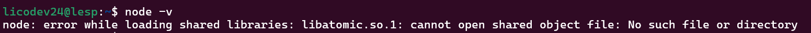

Solution:

```sh
$ sudo apt install libatomic1
```

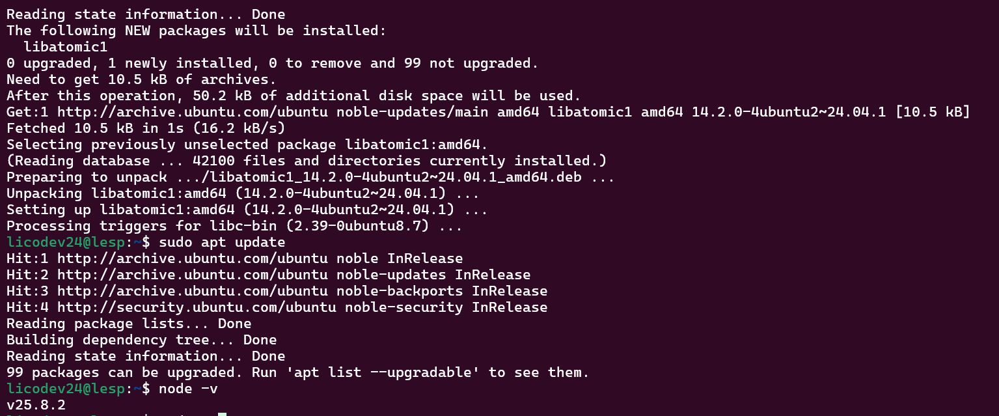

## Claude code

> https://code.claude.com/docs/en/setup

> https://platform.claude.com/docs/en/get-started

```sh
$ npm install -g @anthropic-ai/claude-code
```


### MCP Serena

- Serena

> https://oraios.github.io/serena/02-usage/030_clients.html

```sh
$ npm i -g ccusage
```

`To test`

```sh
$ ccusage blocks --live
```

```sh
$ claude mcp add serena -- uvx --from git+https://github.com/oraios/serena serena start-mcp-server --context claude-code --project "$(pwd)"
```

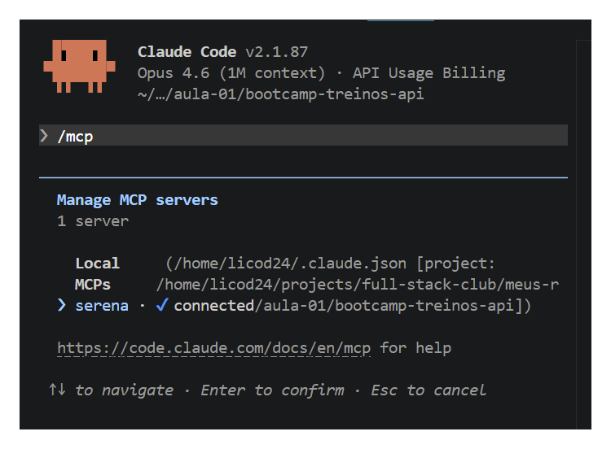

- Local access

http://localhost:24282/dashboard

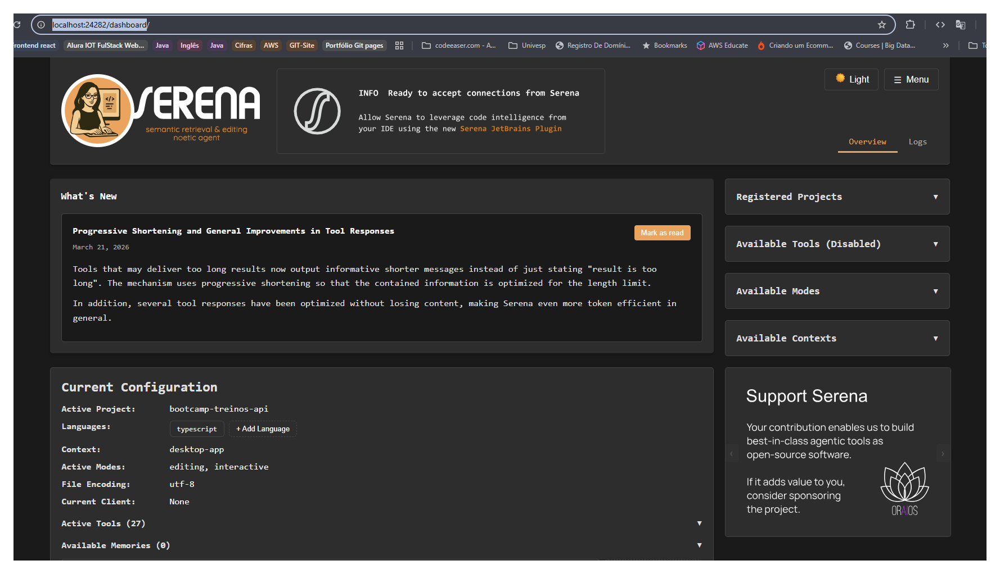

Ver aula 2 - 1:10 sobre MCP

### MCP Figma

- Serve para conectar o Figma diretamente ao Claude Code (um agente de IA no terminal), permitindo que a IA entenda, leia e edite projetos de design de forma estruturada, transformando designs em código de produção e vice-versa.

> https://developers.figma.com/docs/figma-mcp-server/remote-server-installation/#claude-code

- Inserido diretamente no terminal

```sh
claude plugin install figma@claude-plugins-official
```

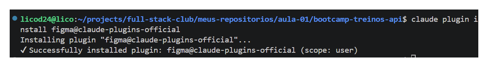

- Inserido no Claude code

```sh
mcp add --transport http figma https://mcp.figma.com/mcp
```

- Depois de inserido no terminal o comando acima

- Reiniciado o Claude code e inserido /mcp para autenticar o Figma

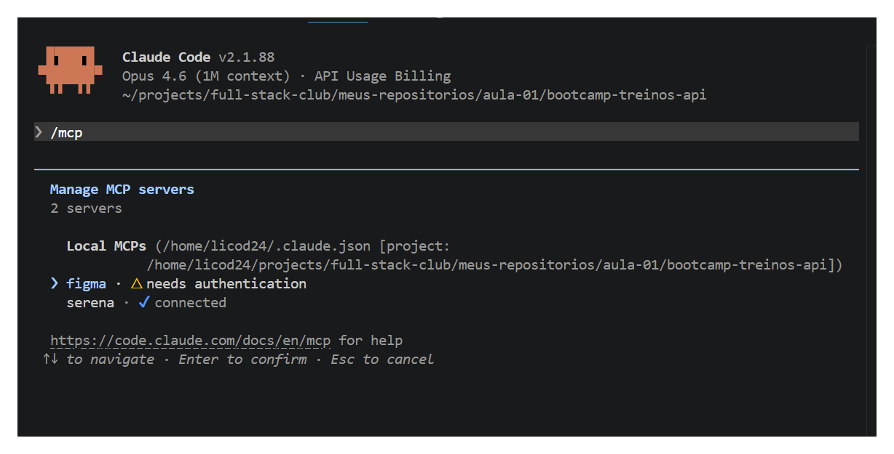

- Enter

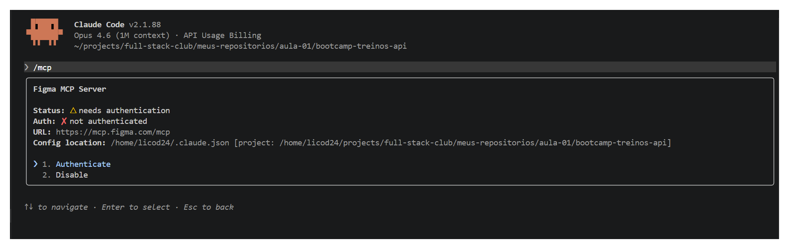

- Enter novamente

- Inserir a url mostrado pelo Claude e clicar em autorizar

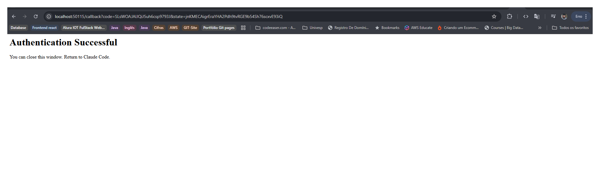

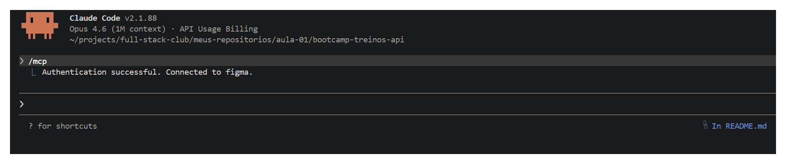

- Autenticado

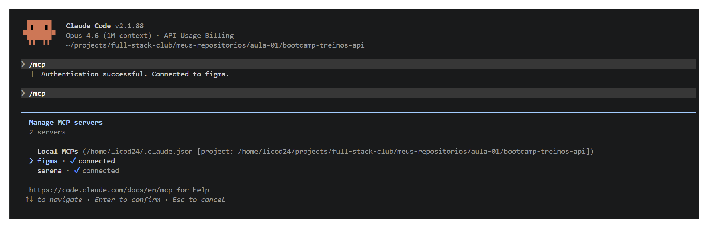

### MCP Context 7

- Serve para que o Claude tenha contexto das documentações mais recentes.

```sh
npx ctx7 setup
```

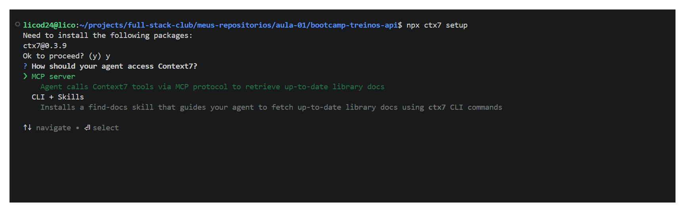

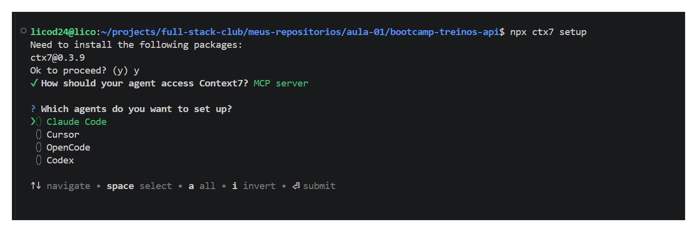

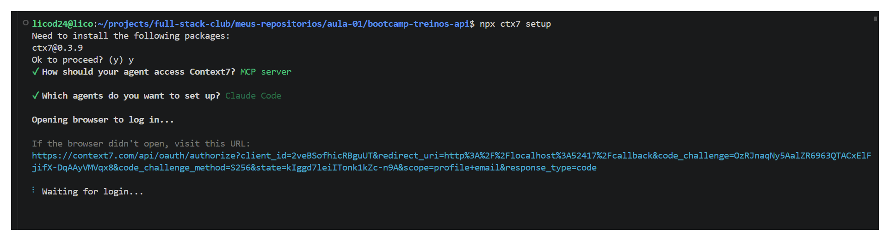

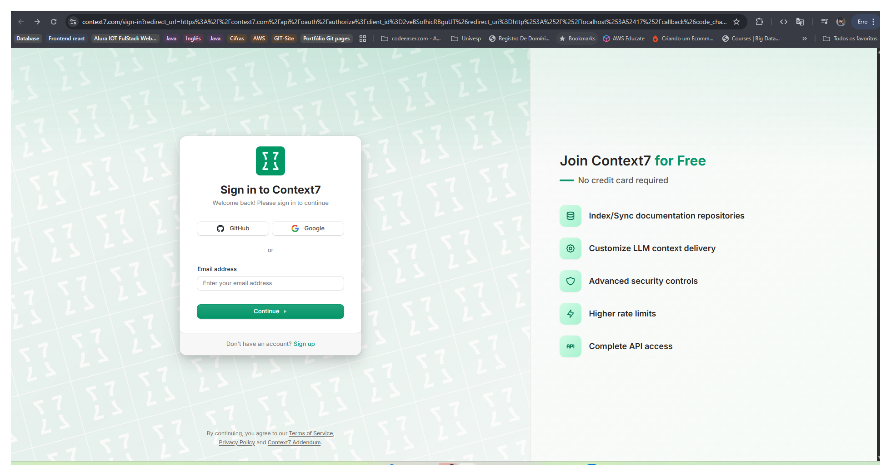

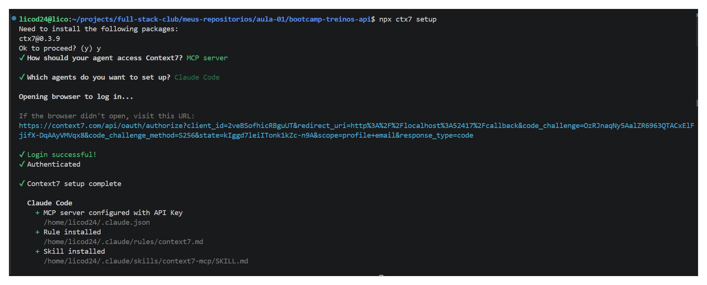

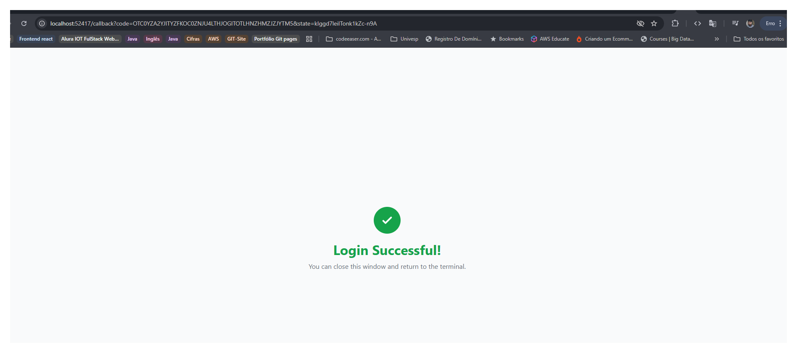

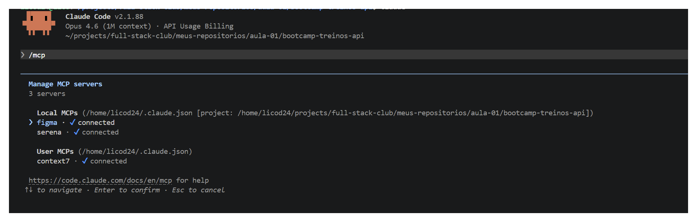

### Inserindo o atributo, rota... para coverImgeUrl

- copiar o arquivo json

[text](<workout-plan (1).json>)

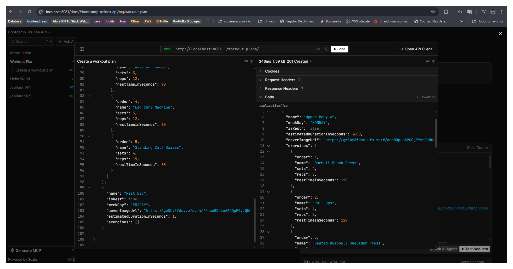

### ❯ Execute @tasks/01.md, movido as rotas para @src/routes/workout-plan.ts.

- Para testar o Workoutsession copiado os IDs de WorkoutPlan, WorkoutDay e no momento do envio desmarcar Content-Type

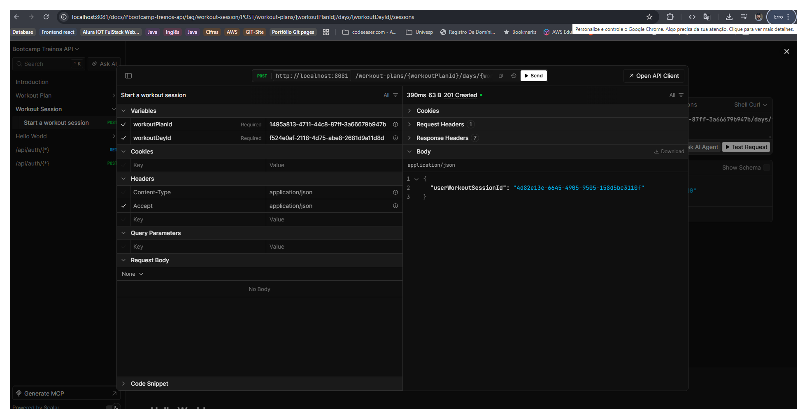

- Se tentar enviar novamente ele da erro

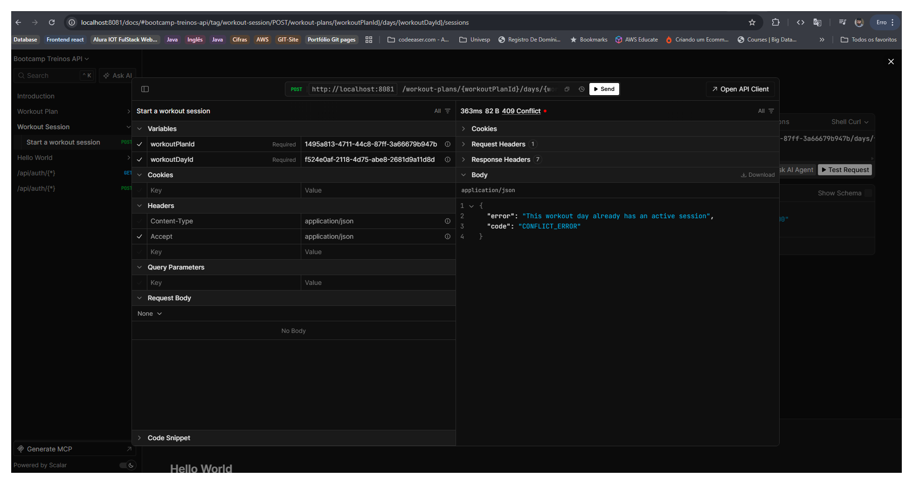
